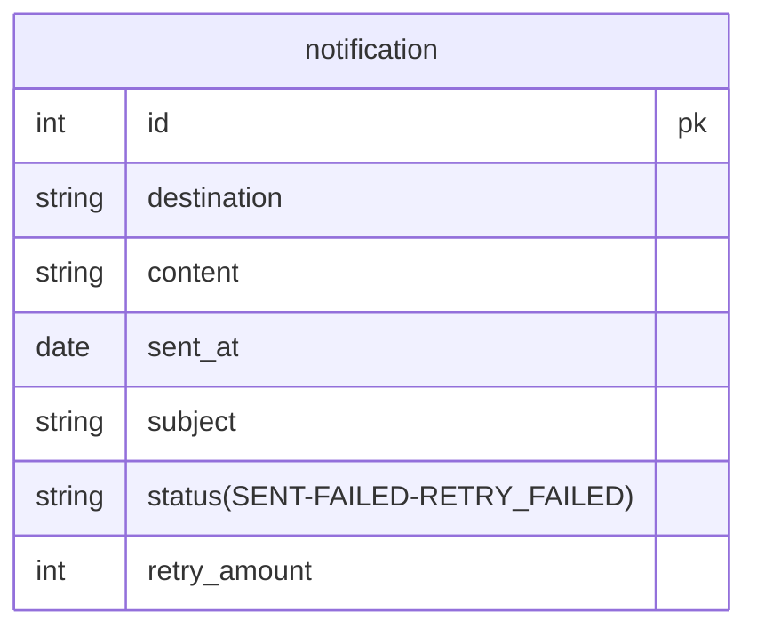

## Description
The notification service is a Spring Boot application designed to handle notifications through email. It integrates with a `Kafka` topic to consume notification requests from an external source, processes these requests, and sends emails using `JavaMailSender`. Additionally, it features a retry mechanism to handle failed email delivery attempts, ensuring robustness and reliability in delivering notifications.
- Note: Its part of a graduation project of Fawry internship.
- All microservices that make the entire ecommerce are here: [fawry final project](https://github.com/Fawry-Project)

## Features ✨

- Kafka Integration: Utilizes Kafka for message queueing, allowing seamless communication and decoupling between services.

- Email Notification: Sends email notifications using JavaMailSender upon receiving requests from the Kafka topic, containing the specified subject and message.

- Retry Mechanism: Implements a retry mechanism for failed email deliveries, ensuring that notifications are eventually sent successfully.

- Scheduled Job: Utilizes Spring's scheduling capability to periodically retry sending failed notifications, enhancing the likelihood of successful delivery over time.

## API Endpoints

| Methods | Endpoints                                |
| :------ | :--------------------------------------- |
| `POST`  | `/api/v1/notification`                   |


## Test the API here:
- [API DOC](http://localhost:8080/v3/api-docs)
- [Swagger UI](http://localhost:8080/swagger-ui/index.html)

## Project structure

<details>
<summary>Click to expand!</summary>

```bash
## Project Structure
📦src
 ┣ 📂main
 ┃ ┣ 📂java
 ┃ ┃ ┗ 📂com
 ┃ ┃ ┃ ┗ 📂fawry
 ┃ ┃ ┃ ┃ ┗ 📂notificationService
 ┃ ┃ ┃ ┃ ┃ ┣ 📜KafkaConsumerConfig.java
 ┃ ┃ ┃ ┃ ┃ ┣ 📜Notification.java
 ┃ ┃ ┃ ┃ ┃ ┣ 📜NotificationController.java
 ┃ ┃ ┃ ┃ ┃ ┣ 📜NotificationRepo.java
 ┃ ┃ ┃ ┃ ┃ ┣ 📜NotificationRequest.java
 ┃ ┃ ┃ ┃ ┃ ┣ 📜NotificationService.java
 ┃ ┃ ┃ ┃ ┃ ┣ 📜NotificationServiceApplication.java
 ┃ ┃ ┃ ┃ ┃ ┣ 📜RetryFailedEmailJob.java
 ┃ ┃ ┃ ┃ ┃ ┗ 📜Status.java
 ┃ ┗ 📂resources
 ┃ ┃ ┣ 📂db
 ┃ ┃ ┃ ┗ 📂migration
 ┃ ┃ ┃ ┃ ┣ 📜V1__Notification_DB.sql
 ┃ ┃ ┃ ┃ ┣ 📜V2__Notification_DB.sql
 ┃ ┃ ┃ ┃ ┗ 📜V3__Add_Column_Retry_Amount.sql
 ┃ ┃ ┣ 📂static
 ┃ ┃ ┣ 📂templates
 ┃ ┃ ┗ 📜application.properties
 ┗ 📂test
 ┃ ┗ 📂java
 ┃ ┃ ┗ 📂com
 ┃ ┃ ┃ ┗ 📂fawry
 ┃ ┃ ┃ ┃ ┗ 📂notificationService
 ┃ ┃ ┃ ┃ ┃ ┣ 📜NotificationRepoTest.java
 ┃ ┃ ┃ ┃ ┃ ┣ 📜NotificationServiceTest.java
 ┃ ┃ ┃ ┃ ┃ ┗ 📜RetryFailedEmailJobTest.java
```

</details>

## Database Schema



## Requirements
- Java Development Kit (JDK) 17 or above
- PostgreSQL Database (You can either use a local PostgreSQL instance or connect to a remote one)
- Maven

## Installation 📥


```bash
> git clone https://github.com/AbdelrahmanShaheen/notification-service-api
> cd notification-service-api/
> mvn clean install
```

## How to use

Edit the `database` and `email` configurations in application.properties file.
Build and run the application using Maven:

```bash
> mvn spring-boot:run
```

the backend server will be running on the specified port on your application.properties file.

## Running Tests 🧪
- To run unit tests:
```shell
mvn test        
```
- To run Integration tests:
```shell
mvn verify        
```


## Tech/Framework used 🧰

- Java
- Spring Boot
- Spring Data JPA
- Kafka
- PostgreSQL
- Flyway for db miagrations
- Docker
- Lombok
- Maven 
- Swagger
- Intellij
- Junit & Mockito
